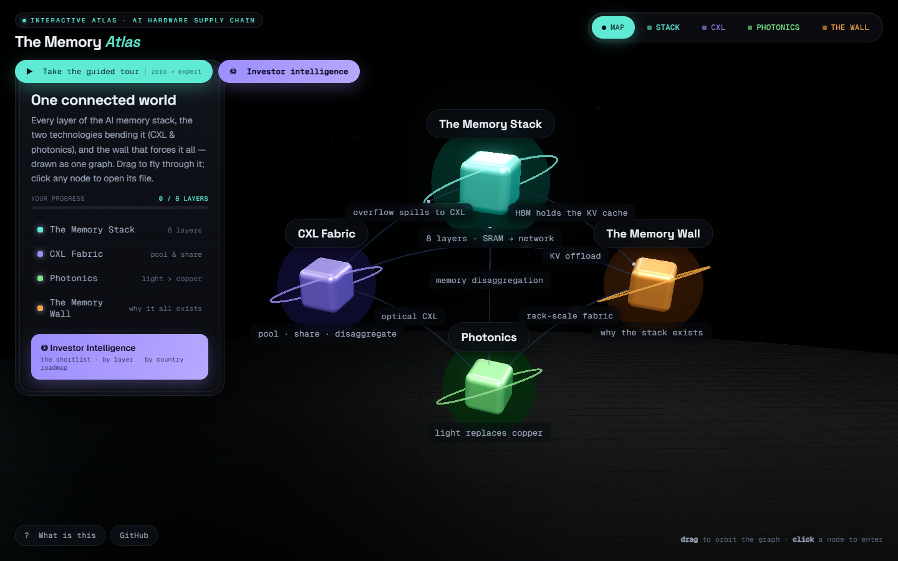
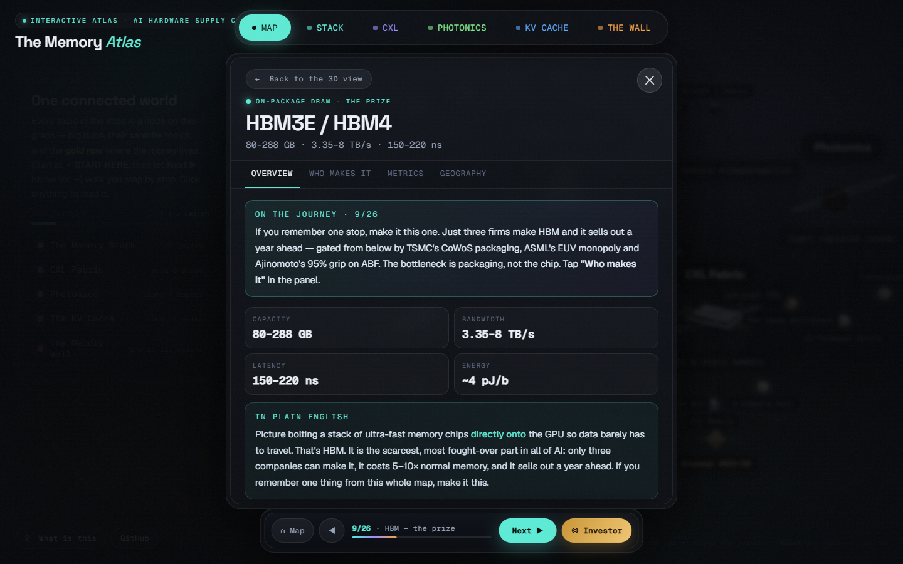
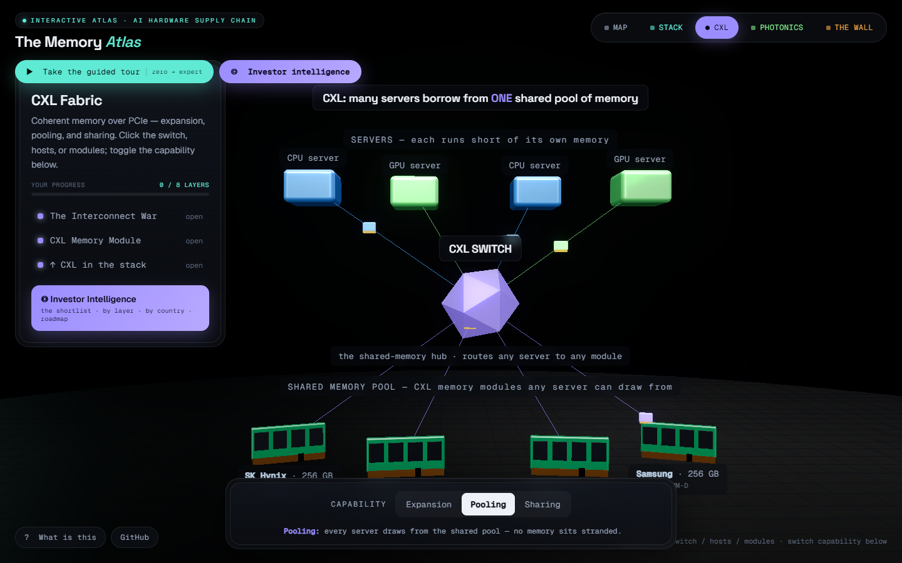
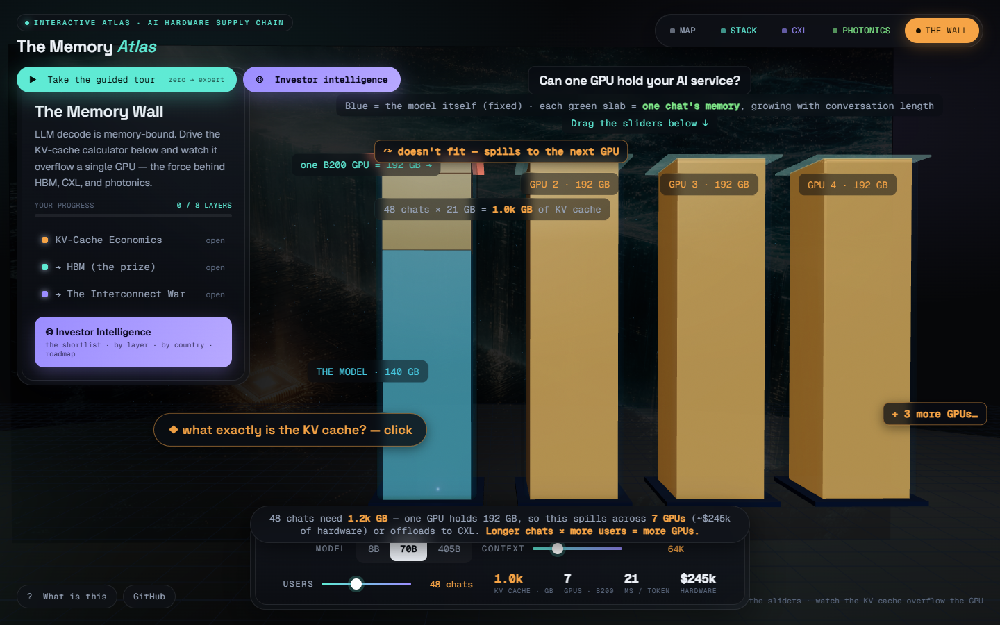

# The Memory Atlas

**An interactive 3D map of the AI memory supply chain — who makes what, where the bottlenecks are, and which companies actually matter.**

**Live: [memory.upamanyuacharya.com](https://memory.upamanyuacharya.com)**



Every AI you use runs on a stack of hardware controlled by a handful of companies. The Memory Atlas takes you from zero knowledge to a working grasp of that stack — the memory hierarchy, HBM, CXL memory pooling, silicon photonics and the memory wall — through a **business and investor lens** rather than a purely technical one. The question it answers isn't *"how does DRAM work"* but *"who makes what, what gates supply, which countries hold the chokepoints, and what metrics move each layer."*

It's a single self-contained HTML file. No build step, no backend, no sign-up.

---

## What's inside

Five interlinked **regions** in one continuous 3D world — drag to orbit, click any glowing node to open its file:

| Region | What it shows |
|---|---|
| **Map** | A knowledge graph of the four themes as glowing nodes joined by labelled relationship edges ("HBM holds the KV cache", "optical CXL"…). Click a node to fly in. |
| **Stack** | The 8-layer memory hierarchy (Registers → L1/L2 → HBM → DDR5 → CXL → NVMe → Network) as glass slabs — width ∝ capacity, particle speed ∝ bandwidth, chokepoints flagged. |
| **CXL** | A shared-memory fabric: four servers, a CXL switch, and a pool of memory modules any server can borrow from. Toggle Expansion / Pooling / Sharing. |
| **Photonics** | Copper vs light: a copper wire whose signal dies mid-way vs a clickable laser firing wavelength-multiplexed light across the fibre. The laser is the bottleneck — click it. |
| **The Wall** | A live KV-cache calculator rendered as a "memory tank": one GPU's 192 GB, weights filling the bottom, the KV cache filling the top. Push context length or users and watch it overflow — with GPUs-needed, $ cost and ms/token computed live. |



Every clickable object opens a **fractal reading panel** — Overview · Who makes it · Metrics · Geography — with a plain-English intro before any jargon, market-share bars where there's an oligopoly, a bottleneck-severity meter, real source links, and **company cards** that link both ways: click a company and see every other node in the atlas it touches.

### Investor Intelligence

A dedicated command centre with four tabs:

- **The shortlist** — the names that structurally define the map (chokepoint monopolies, scale players, pure-plays) and why.
- **By layer** — every public ticker in the chain, grouped by where it sits, dotted by chokepoint severity.
- **By country** — where each critical step physically happens, ordered by single-point-of-failure risk (Taiwan, Korea, the Netherlands, Japan…).
- **Roadmap** — 2025 → 2030: what ships when, and who benefits.

### Guided tour

A 6-step zero-to-expert walkthrough that starts with the problem (LLM decode is memory-bound — the GPU waits ~1,200× longer on memory than on math), opens the right nodes as it goes, and quizzes you Socratically along the way. Khan Academy pedagogy: stakes first, plain English before jargon, one clear action at a time.




---

## Run it locally

```bash
git clone https://github.com/upamanyuacharya/memory-atlas.git
cd memory-atlas
# quickest: just open index.html (clicks work on file://)
# or serve it:
python -m http.server 4319   # → http://127.0.0.1:4319/
```

It loads Three.js r161 and Google Fonts from CDNs, so it needs an internet connection.

---

## Architecture

Everything lives in **`index.html`**: a `<style>` design system, an import map, and one ES-module `<script>`.

**Content model (edit these to extend the atlas):**

| Structure | What it holds |
|---|---|
| `CO` | The company dictionary, keyed by id: name, ticker, country, role, what it makes, watch-metrics. |
| `COURL` | Investor-relations / news URL per company. |
| `HIER` | The 8 memory-hierarchy layers: specs, blurb, business take, companies, geography, metrics, relations. |
| `EXTRA` | The deep nodes (interconnect war, CXL module, hosts, laser, CPO, transceivers, KV economics). |
| `ELI` | The "in plain English" paragraph per node — the zero-knowledge on-ramp. |
| `SRC` | Further-reading links per node (real URLs). |
| `WATCH_GROUPS` / `GEO` / `ROADMAP` / `SHORTLIST` | The four Investor Intelligence tabs. |
| `MAPNODES` / `MAPEDGES` | The overview knowledge graph. |

**Engine:** `findNode(id)` resolves nodes; `companyBacklinks(cid)` computes the reverse index (which nodes a company touches); `openNode`/`renderPanelBody` drive the reading panel; `buildMap`/`buildHierarchy`/`buildCXL`/`buildPhotonics`/`buildAI` construct each region's Three.js scene; `enterRegion` swaps them; `renderIntel` drives the modal.

**To add a company:** add an entry to `CO`, list its id in any node's `cos`, and optionally in `WATCH_GROUPS`/`GEO`/`ROADMAP`/`SHORTLIST`. Backlinks, chips and cards wire up automatically.

### Engineering notes (learned the hard way)

- **Raycasting** binds to the canvas (`renderer.domElement`), not the CSS2D label layer, and calls `camera.updateMatrixWorld()` before every pick — otherwise clicks silently miss when the frame loop is throttled (e.g. on `file://`).
- **Performance:** frame rate is capped at ~30 fps and `pixelRatio` at 1.4, bloom is tuned low (0.26). This halves GPU load and keeps laptop fans quiet without visibly hurting the aesthetic.
- **Hidden tabs:** `requestAnimationFrame` pauses when a tab is backgrounded; a 350 ms heartbeat keeps the canvas paintable. Don't gate content visibility on CSS entry animations — they also pause.
- **Materials:** `MeshPhysicalMaterial` `transmission` is too heavy with bloom; clearcoat + a `RoomEnvironment` env-map gets the glass look cheaply.
- **Logos:** only ~5 of these firms exist in icon CDNs; the rest get deterministic colour-tinted monograms. Don't add a `slug` unless `cdn.simpleicons.org/<slug>` returns 200.

---

## Content provenance & disclaimer

Figures (HBM share, CoWoS lead times, the NVIDIA laser lockup, ASML/Ajinomoto monopolies, the NVLink-vs-UALink timeline, Astera/Coherent/Lumentum numbers, etc.) were compiled **mid-2026** from manufacturer disclosures, trade reporting (TrendForce / Counterpoint / Dell'Oro-type sources) and company filings, via three research passes. Market shares move quarter to quarter — treat them as directional.

**This is educational structural analysis, not investment advice.** Nothing here is a recommendation to buy or sell any security.

## Versioning

Semantic versioning via git tags — see [CHANGELOG.md](CHANGELOG.md). Content refreshes (new figures, new companies) bump the minor version; visual/structural reworks bump as appropriate.

## Credits

Built by [Upamanyu Acharya](https://upamanyuacharya.com) with [Claude Code](https://claude.com/claude-code). Three.js r161 · Space Grotesk / Geist / Geist Mono · concept art generated with gpt-5.4-image-2.

## License

[MIT](LICENSE)
