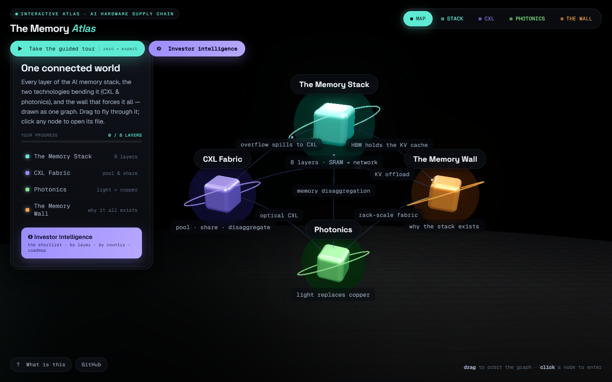
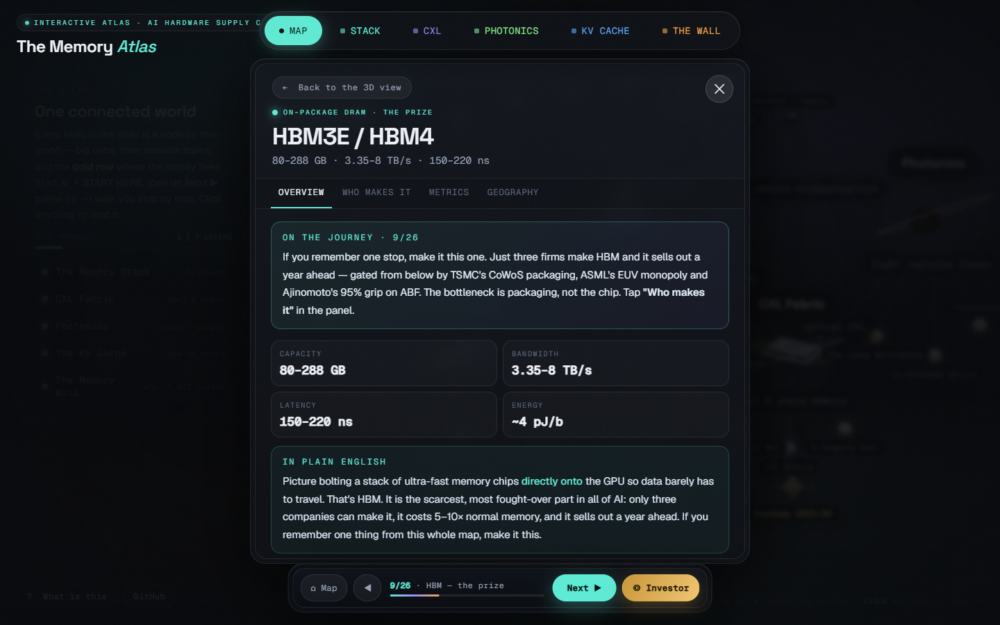
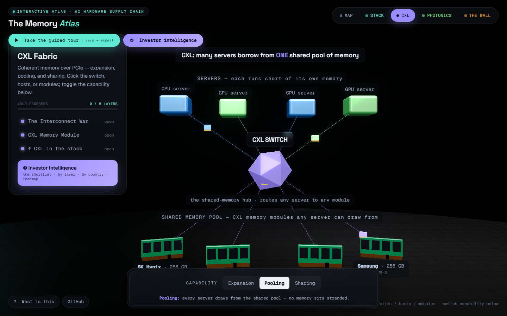
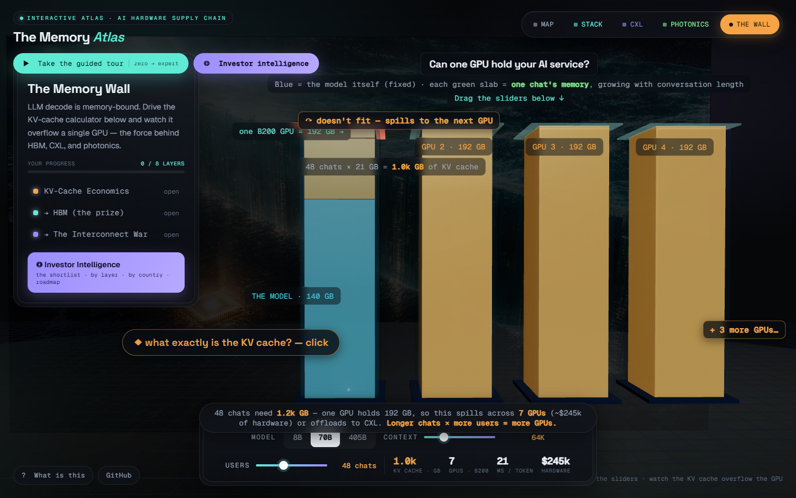

# The Memory Atlas

**An interactive 3D map of the AI memory supply chain — who makes what, where the bottlenecks are, and which companies actually matter.**

**Live: [memory.upamanyuacharya.com](https://memory.upamanyuacharya.com)**



Every AI you use runs on a stack of hardware controlled by a handful of companies. The Memory Atlas takes you from zero knowledge to a working grasp of that stack — the memory hierarchy, HBM, CXL memory pooling, silicon photonics and the memory wall — through a **business and investor lens** rather than a purely technical one. The question it answers isn't *"how does DRAM work"* but *"who makes what, what gates supply, which countries hold the chokepoints, and what metrics move each layer."*

It's a single self-contained HTML file (plus a plain-text edition of every page at [/read/](https://memory.upamanyuacharya.com/read/)). No backend, no sign-up. Every fact is dated — look for the **Data as of** chip.

---

## What's inside

Six interlinked **regions** in one continuous 3D world. The landing page is the map itself — a **▾ START HERE** pointer marks the story's first stop, and the **journey bar** at the bottom (or **N** / **P**) walks you through all 30 stops in order, zero to expert. **WASD / arrow keys glide the camera** around any scene; drag orbits, scroll zooms. Click any glowing node at any time to open its file; the journey continues from wherever you wander. **Every state has a URL** — copy-link buttons sit on every file, caption and investor tab. (On a phone, a sheet offers the text edition first.)

| Region | What it shows |
|---|---|
| **Map** | The full knowledge graph — every topic in the atlas as a miniature of its real hardware. Five hubs in story order (the Wall → KV Cache → the Stack → CXL → Photonics), 18 satellite topics (dies, an HBM stack, a DIMM, switch silicon, an M.2 stick, a 2U server, a laser TO-can, a CPO package, a pluggable transceiver, a mini memory tank… plus the three stories that move the tickers: **The DRAM Cycle**, **The HBM4 Base Die** and **China's Stack**), labelled relationship edges, and a **gold-ingot investor row** along the bottom that opens the five Intel tabs directly. |
| **Stack** | The 8-layer memory hierarchy (Registers → L1/L2 → HBM → DDR5 → CXL → NVMe → Network) as glass slabs — width ∝ capacity, particle speed ∝ bandwidth, chokepoints flagged — each carrying a recognizable mini of its real hardware (HBM die stack, DIMM, M.2 stick…). |
| **CXL** | A shared-memory fabric: four 2U rack servers, real CXL switch silicon on its substrate, and a pool of RAM modules any server can borrow from. Toggle Expansion / Pooling / Sharing. |
| **Photonics** | Copper vs light: a DAC copper run whose signal dies mid-way vs a laser TO-can firing wavelength-multiplexed light down a clad fibre into a real GPU package (compute die + HBM stacks). The laser is the bottleneck — click it. |
| **KV Cache** | How the cache actually works, word by word: the newest word is the *query*, every earlier word holds a stored *key/value* pair (attention beams look back), and each step appends exactly one new pair. Toggle the cache off and watch every step recompute everything — the waste the cache prevents, with live computation counters. |
| **The Wall** | A live KV-cache calculator rendered as GPU "memory tanks": one tank = one B300's 288 GB. The blue block is the model (fixed); every chat adds one green slab that grows with conversation length. When the tank fills, the excess pours into more GPUs on the right — with GPUs-needed, $ cost and ms/token computed live. The same calculator exists as a [standalone page](https://memory.upamanyuacharya.com/read/wall.html). |



Every clickable object opens **reading mode** — the file takes centre stage as a large reading column while the 3D world dims and blurs into the background (a "← Back to the 3D view" button, ✕, Esc or a click outside all return you). Each file is fractal — Overview · Who makes it · Metrics · Geography — with a plain-English intro before any jargon, market-share bars where there's an oligopoly, a bottleneck-severity meter, real source links, and **company cards** that link both ways: click a company and see every other node in the atlas it touches.

### Investor Intelligence

The money is structural, not a sidebar: five **gold nodes** on the map (with gold threads climbing to the tech they price), a persistent gold **◎ Investor** button in the journey bar, and the journey's final stops all land here — a command centre with five tabs:

- **The shortlist** — the names that structurally define the map (chokepoint monopolies, scale players, pure-plays) and why.
- **By layer** — every public ticker in the chain, grouped by where it sits, dotted by chokepoint severity.
- **By country** — where each critical step physically happens, ordered by single-point-of-failure risk (Taiwan, Korea, the Netherlands, Japan, China…).
- **The numbers** — a static, dated valuation snapshot: market cap, price, 12-month return (only where two sources agreed), forward P/E.
- **Roadmap — graded** — 2025 → 2030: what ships when, and who benefits. Every entry whose date has passed carries a verdict and a "what actually happened" line: the atlas grades its own forecasts.

### The journey

A 30-stop zero-to-expert spine through the whole atlas, driven by the persistent bottom bar (**Next ▶** / **◀**, or **N** / **P** on the keyboard — the arrows are for gliding). It starts with the problem (LLM decode is memory-bound — the GPU waits ~1,200× longer on memory than on math), then walks every stack layer, every deep node and the four investor tabs, teaching in the flow: region stops float a caption card, node stops lead their reading page with an "ON THE JOURNEY" block. Wander freely — the pointer re-syncs to wherever you actually are. Khan Academy pedagogy: stakes first, plain English before jargon, one clear action at a time.




---

### Deep links

Every state has a URL, so anything can be shared or bookmarked:

| URL | Lands on |
|---|---|
| `/#stack` `/#cxl` `/#photonics` `/#kvcache` `/#wall` | a region |
| `/#node/hbm` `/#node/phot_laser` … | a file, in reading mode, in its region |
| `/#stop/9` | journey stop 9 (with its caption) |
| `/#intel/geo` | an Investor Intelligence tab (`short` `watch` `geo` `numbers` `road`) |
| `/#wall/3/64/32` | the Wall with model 3 (1T MoE), 64K context, 32 chats |

### The text edition

[`/read/`](https://memory.upamanyuacharya.com/read/) is every page of the atlas as plain, fast HTML — the 30-stop journey as a reading list, every node file, every company (with backlinks), the five investor views and the Wall calculator — prerendered from the same data file, phone-first, with proper metadata for crawlers. It is what phones, no-WebGL browsers and search engines get; every page links back into the 3D atlas by deep link.

---

## Run it locally

```bash
git clone https://github.com/upamanyuacharya/memory-atlas.git
cd memory-atlas
# quickest: just open index.html (clicks work on file://)
# or serve it:
npm run dev                  # python -m http.server 4323 → http://127.0.0.1:4323/
```

It loads Three.js r161 and Google Fonts from CDNs, so it needs an internet connection.

### Editing the content

```bash
npm i              # once
# edit data/atlas-data.js — the only file a content refresh touches
npm run build      # inlines the data into index.html + regenerates /read/ and sitemap.xml
npm run verify     # fails if index.html is stale, then runs the harness
```

---

## Architecture

The engine lives in **`index.html`**: a `<style>` design system, an import map, and one ES-module `<script>`. The content lives in **`data/atlas-data.js`** and is inlined into `index.html` between `@@DATA` markers by `tools/build.mjs`, which also prerenders `/read/` (`tools/read.mjs`, `tools/wall.mjs`) and `sitemap.xml`. The deliverable is still one self-contained file.

**Content model (edit `data/atlas-data.js` to extend the atlas):**

| Structure | What it holds |
|---|---|
| `CO` | The company dictionary, keyed by id: name, ticker, country, role, what it makes, watch-metrics. |
| `COURL` | Investor-relations / news URL per company. |
| `HIER` | The 8 memory-hierarchy layers: specs, blurb, business take, companies, geography, metrics, relations. |
| `EXTRA` | The deep nodes (interconnect war, CXL module, hosts, laser, CPO, transceivers, KV economics). |
| `ELI` | The "in plain English" paragraph per node — the zero-knowledge on-ramp. |
| `SRC` | Further-reading links per node (real URLs). |
| `WATCH_GROUPS` / `GEO` / `ROADMAP` / `SHORTLIST` / `VALUATION` | The five Investor Intelligence tabs. `ROADMAP` entries carry a `v` verdict once their date has passed. |
| `JOURNEY` | The 30 ordered stops (region, node or intel tab, caption). |
| `SERVING` / `MODELS` / `KV_DEFAULT` | The Wall's GPU contract, model classes and default scene — shared with `/read/wall.html`. |
| `DATA_ASOF` | The date every fact was last verified; drives the "Data as of" chip. |
| `MAPNODES` / `MAPEDGES` / `MAPSATS` / `MAPGOLD` (engine) | The overview knowledge graph's layout. |

**Engine:** `findNode(id)` resolves nodes; `companyBacklinks(cid)` computes the reverse index (which nodes a company touches); `openNode`/`renderPanelBody` drive the reading panel; `buildMap`/`buildHierarchy`/`buildCXL`/`buildPhotonics`/`buildAI` construct each region's Three.js scene; `enterRegion` swaps them; `renderIntel` drives the modal.

**To add a company:** add an entry to `CO`, list its id in any node's `cos`, and optionally in `WATCH_GROUPS`/`GEO`/`ROADMAP`/`SHORTLIST`. Backlinks, chips and cards wire up automatically.

### Verification harness

```bash
npm i                  # once — playwright-core drives your installed Edge, no browser download
npm run verify         # build check + 12 gates (8 visual states + journey / glide / router / idle-rest)
npm run verify:update  # re-bless baselines after an intended visual change
```

[`tools/verify.mjs`](tools/verify.mjs) drives every region into a known state, freezes the
app's owned clock (`__atlas.freeze(t)` — all animation keys off an injectable time source
and seeded RNG, so frames are deterministic), then gates on three levels: DOM assertions,
**pixel-class content probes** ("amber spill pixels must exist in the right half" — because
healthy stats don't prove the GPU rendered anything), and a mean-diff comparison against
blessed baselines in `tools/baselines/`. Run-to-run drift measures 0.00–0.15%.

### Renderer contracts

- **Camera owner:** every region is framed from the `RIGS` table via `camEnter`/`camGlide`;
  the rigs bake in the UI safe areas (left rail, top nav band, bottom dock). No builder
  hand-rolls a pose.
- **Render phases:** depth is an access contract, not a boolean. Opaque world geometry
  writes depth; `glassify()` (tank shells) reads but never writes it and renders after its
  contents; `fxPoints()` (additive particles) never writes depth. A depth-writing
  transparent shell can depth-kill everything inside it — that was a real shipped bug.
- **Determinism:** scene randomness comes from a seeded RNG (reset per region build);
  animation reads the owned clock `T`, never `performance.now()`/`clock.elapsedTime`
  directly. This is what makes the screenshot gates byte-comparable.
- **Serving numbers:** the GPU name, 288 GB capacity, $/GPU and bandwidth factor the Wall
  reasons about live in one `SERVING` object (in the data file) consumed by the headline,
  caption, dock, rim label, the math — and the standalone `/read/wall.html`.
- **Router:** state → URL via `syncHash()` (muted while `applyRoute()` drives state, and
  while the journey is navigating); URL → state via `applyRoute()` on boot and `hashchange`.
  The boot hash is captured *before* the first `enterRegion`, which would otherwise rewrite it.

### Engineering notes (learned the hard way)

- **Raycasting** binds to the canvas (`renderer.domElement`), not the CSS2D label layer, and calls `camera.updateMatrixWorld()` before every pick — otherwise clicks silently miss when the frame loop is throttled (e.g. on `file://`).
- **Performance (GPU):** no post-processing — bloom (EffectComposer + UnrealBloomPass) was the single biggest GPU cost and it defeated MSAA, so the scene renders directly (real antialiasing, ~half the GPU work); the glow comes from emissive materials, halos and additive particles. Frame rate is adaptive: ~30 fps while interacting or the camera moves, ~12 fps once settled (all motion is dt-based so speeds don't change). Pixel ratio obeys a ~3.2M-pixel budget so 1440p/4K screens don't quadruple raster cost.
- **Performance (idle = free):** the render loop is **on-demand**, not continuous — a settled scene draws zero frames (`renderer.render` isn't called at all) and only wakes within ~9s of an interaction, during a tween, or while the KV auto-writer runs. Measured idle 0 fps / active 31 fps. There is **no** `powerPreference:'high-performance'` (Chrome's low-power default keeps the discrete GPU asleep on laptops), no hidden-tab heartbeat, and no perpetual idle auto-rotate. Region builds call `renderer.compileAsync()` to warm shaders off-thread (kills first-frame stutter), and backdrop textures are cached, not re-uploaded per visit. The `idle-rest` harness gate guards all of this.
- **Performance (CPU/compositor):** never put `backdrop-filter` on elements that move every frame (the 3D labels had it — a moving blur region forces a full CPU re-blur per frame), and never put `mix-blend-mode` layers over a canvas that repaints (full-screen re-composite). Hover raycasting is throttled to 20 Hz. The KV visualiser pools its meshes and labels — slider drags never allocate geometry.
- **Hidden tabs:** `requestAnimationFrame` pauses when a tab is backgrounded — that is correct behaviour (the old 350 ms heartbeat was removed in v1.6.0); `visibilitychange` re-wakes the loop for a fresh frame. Don't gate content visibility on CSS entry animations — they also pause.
- **Shader warm-up:** three's `compileAsync` polls `properties.get(material).currentProgram.isReady()` and throws if a material was disposed mid-compile (a region switch during warm-up). `warmShaders()` does the same thing generation-guarded and disposal-tolerant.
- **Materials:** `MeshPhysicalMaterial` `transmission` is too heavy with bloom; clearcoat + a `RoomEnvironment` env-map gets the glass look cheaply.
- **Logos:** only ~5 of these firms exist in icon CDNs; the rest get deterministic colour-tinted monograms. Don't add a `slug` unless `cdn.simpleicons.org/<slug>` returns 200.

---

## Content provenance & disclaimer

Figures (HBM share and Rubin allocation, CoWoS capacity, DRAM contract prices, the NVIDIA optics stakes, ASML/Ajinomoto monopolies, the NVLink-vs-UALink timeline, Astera/Coherent/Lumentum numbers, China's position, the valuation snapshot, etc.) were last re-verified on **13 September 2026** from manufacturer disclosures, trade reporting (TrendForce / Counterpoint / LightCounting-type sources) and company filings — the source dossier is in [`docs/research/`](docs/research/). `DATA_ASOF` in the data file is the single date the atlas shows. Market shares move quarter to quarter — treat them as directional. Past roadmap entries are graded against what actually happened rather than quietly rewritten.

**This is educational structural analysis, not investment advice.** Nothing here is a recommendation to buy or sell any security.

## Versioning

Semantic versioning via git tags — see [CHANGELOG.md](CHANGELOG.md). Content refreshes (new figures, new companies) bump the minor version; visual/structural reworks bump as appropriate.

## Credits

Built by [Upamanyu Acharya](https://upamanyuacharya.com) with [Claude Code](https://claude.com/claude-code). Three.js r161 · Space Grotesk / Geist / Geist Mono · concept art generated with gpt-5.4-image-2.

## License

[MIT](LICENSE)
